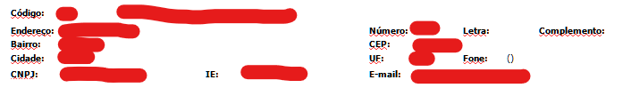

# Como rodar o projeto do zero

## Instalando o Ubuntu no Windows Subsystem for Linux (WSL)

### 1. Habilitar o WSL:

1. Abra o "Painel de Controle" no Windows.
2. Vá para "Programas" ou "Programas e Recursos".
3. Clique em "Ativar ou desativar recursos do Windows".
4. Marque a opção "Plataforma de Subsistema Windows para Linux".
5. Clique em "OK" e reinicie o computador quando solicitado.

### 2. Instalar uma Distribuição Linux (Ubuntu):

1. Abra a Microsoft Store (ou Microsoft Store para Empresas, se aplicável) no Windows.
2. Pesquise por "Ubuntu" na barra de pesquisa.
3. Escolha a versão do Ubuntu que deseja instalar (por exemplo, "Ubuntu 20.04 LTS").
4. Clique no botão "Obter" para iniciar o download e instalação.

### 3. Configurar a Distribuição Linux (Ubuntu):

1. Após a instalação, abra o Ubuntu a partir do menu Iniciar ou digitando "Ubuntu" na barra de pesquisa.
2. A primeira vez que você abre o Ubuntu, ele configurará o ambiente e solicitará que você crie um nome de usuário e senha.
3. Siga as instruções na tela para concluir a configuração.

### 4. Usar o Ubuntu no WSL:

1. Depois de configurado, você pode iniciar o terminal do Ubuntu a qualquer momento a partir do menu Iniciar ou digitando "Ubuntu" na barra de pesquisa.
2. Use o terminal do Ubuntu para executar comandos e interagir com a distribuição Linux.

### 5. Atualizar Pacotes:

Antes de começar a usar o Ubuntu no WSL, é uma boa prática atualizar os pacotes.

```bash
sudo apt update
sudo apt upgrade
```
### 7. Clone o projeto:

1. Abra o terminal do Ubuntu.
2. Execute os seguintes comandos para baixar o projeto:

```bash
git clone https://github.com/imLeonam/xlsx-parser.git
```

3. Se o gitHub reclamar alguma coisa sobre identificação ou ssh acesse esse site para resolver, mas leia bem antes de rodar os comandos pedidos.

[Site de tutorial para configurar o SSH no GitHub](https://www.theserverside.com/blog/Coffee-Talk-Java-News-Stories-and-Opinions/GitHub-SSH-Key-Setup-Config-Ubuntu-Linux)

### 6. Instalar o Node.js e o npm:

1. Abra o terminal do Ubuntu.
   #### Instalção pelo setup.sh
   1. Execute os seguintes comandos separadamente.
   ```bash
   cd xlsx-parser
   bash setup.sh
   ```
   #### Instalação manual
  1. Execute os seguintes comandos para instalar o Node.js e o npm:

  ```bash
  sudo apt install nodejs
  sudo apt install npm
  ```

  3. Se preferir pode usar o yarn
  
  ```bash
  npm install -g yarn
  ```

### 8. Iniciar o projeto

1. Execute os seguintes comandos para instalar as dependencias do projeto

```bash
npm install
```

ou

```bash
yarn
```

2. Para rodar o projeto execute algum dos comandos abaixo

```bash
npm run start
```

ou

```bash
yarn start
```

### 9. Os dados das planilhas que deseja limpar precisam ter um formato parecido com esse:



```bash
# Estrutura:
"chave: valor"
```
### 10. Sempre apague o que não é registro do começo da tabela e duplique o ultimo grupo da tabela, não consegui fazer ele pegar o ultimo sem essa intervenção ainda
